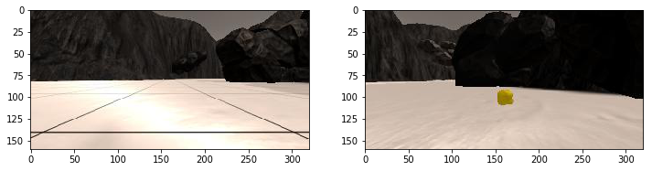
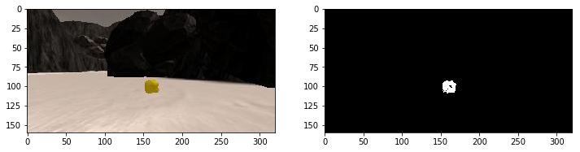
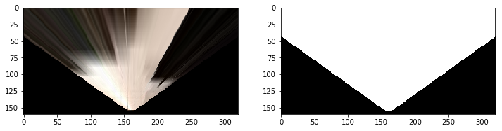
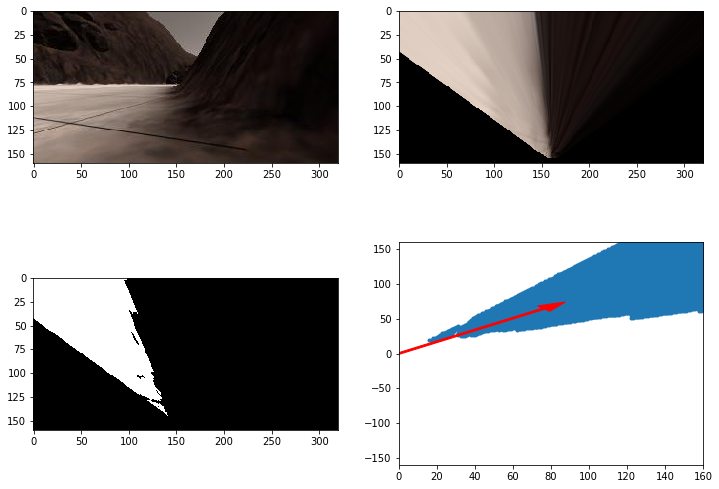

[//]: # (Image References)
[image_0]: ./misc/rover_image.jpg
[](https://www.udacity.com/robotics)
# Search and Sample Return Project


![alt text][image_0] 

This project is modeled after the [NASA sample return challenge](https://www.nasa.gov/directorates/spacetech/centennial_challenges/sample_return_robot/index.html) and it will give you first hand experience with the three essential elements of robotics, which are perception, decision making and actuation.  You will carry out this project in a simulator environment built with the Unity game engine.  

## The Simulator
The first step is to download the simulator build that's appropriate for your operating system.  Here are the links for [Linux](https://s3-us-west-1.amazonaws.com/udacity-robotics/Rover+Unity+Sims/Linux_Roversim.zip), [Mac](	https://s3-us-west-1.amazonaws.com/udacity-robotics/Rover+Unity+Sims/Mac_Roversim.zip), or [Windows](https://s3-us-west-1.amazonaws.com/udacity-robotics/Rover+Unity+Sims/Windows_Roversim.zip).  

You can test out the simulator by opening it up and choosing "Training Mode".  Use the mouse or keyboard to navigate around the environment and see how it looks.

## Dependencies
You'll need Python 3 and Jupyter Notebooks installed to do this project.  The best way to get setup with these if you are not already is to use Anaconda following along with the [RoboND-Python-Starterkit](https://github.com/ryan-keenan/RoboND-Python-Starterkit). 


Here is a great link for learning more about [Anaconda and Jupyter Notebooks](https://classroom.udacity.com/courses/ud1111)

## Recording Data
I've saved some test data for you in the folder called `test_dataset`.  In that folder you'll find a csv file with the output data for steering, throttle position etc. and the pathnames to the images recorded in each run.  I've also saved a few images in the folder called `calibration_images` to do some of the initial calibration steps with.  

The first step of this project is to record data on your own.  To do this, you should first create a new folder to store the image data in.  Then launch the simulator and choose "Training Mode" then hit "r".  Navigate to the directory you want to store data in, select it, and then drive around collecting data.  Hit "r" again to stop data collection.

## Data Analysis
Included in the IPython notebook called `Rover_Project_Test_Notebook.ipynb` are the functions from the lesson for performing the various steps of this project.  The notebook should function as is without need for modification at this point.  To see what's in the notebook and execute the code there, start the jupyter notebook server at the command line like this:

```sh
jupyter notebook
```

#### Calibration 
To perform the appropriate transformations we need to use initial calibration images. One uses a grid to measure distance, the other is an example of a rock that the Rover is looking for.


The rocks appear to have an approximate RGB value of (110, 110, 50) and that is used to threshold the images to identify rocks.



#### Perspective Transformation
It's important to transform the Rover image to world-view coordinates in order to identify obstacles and determine the best path forward.  This is done by applying a rotation and transformation using the `pix_to_world()` function.
The unnavigable areas are identified by thresholding anything above the RGB value of (160,160,160).



Once the navigable terrain identified, we can identify the best path by taking the average angle of the origin to all the navigable pixels.




## Navigating Autonomously
The `decision.py` file was altered to help better navigate the rover.  A function `get_steer_angle` was created to improve the method for calculating the next steering angle.
It uses a weighted average of angles to navigable pixels, weighted by 1/sqrt(Rover.nav_dists)) so closer pixels are weighted more highly.

Also, two new Rover modes were created called 'Collecting' and 'Stuck'.  'Collecting' mode starts whenever a rock is in view, and it navigates towards the rock and picks it up.  
The 'Stuck' mode starts when the Rover is in 'forward' mode for > 4 seconds but has a Rover speed < 0.01 m/s.  While in 'Stuck' mode the Rover reverses steering direction throttle direction.

The Rover is able to find and retrieve all 6 objects, it can map >90% of the map with >70% fidelity.
The results were obtained with a resolution of 1024x768 with the Fantastic video quality.

### Ideas for improvement
There are certain rocks that the Rover is likely to get stuck in, where the 'Stuck' mode is incapable of getting the Rover unstuck.  Identifying these problem rocks and avoiding them would help.  
Moreover, certain areas of the map can remain unexplored.  It would be helpful to give more weight to unexplored pixels when updating the steering angle.